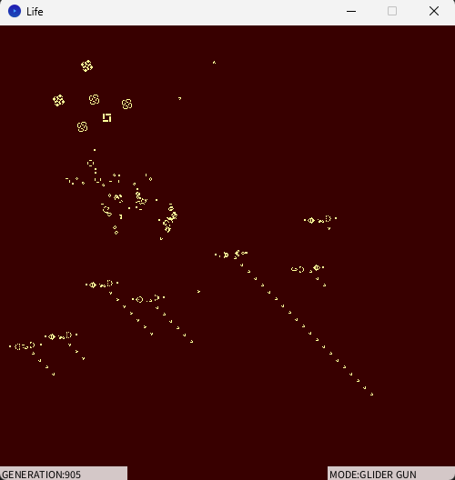
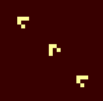
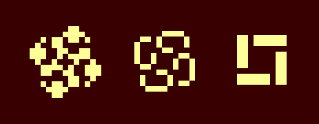
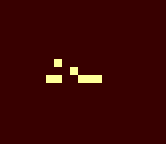
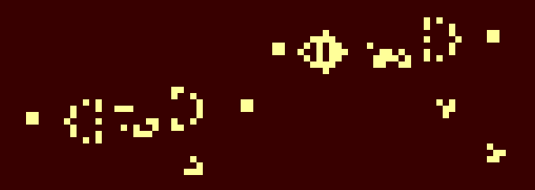
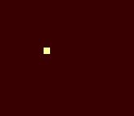

# 概要

簡易的な[ライフゲーム](https://ja.wikipedia.org/wiki/%E3%83%A9%E3%82%A4%E3%83%95%E3%82%B2%E3%83%BC%E3%83%A0)のシミュレーターです。

# 操作方法

- クリック：マウスポインタの場所にパターンを生成
- ↑/↓：パターンの種類を切替
- R：リセット
- Esc：終了
- その他のキー：一時停止

## 収録パターン

### GLIDER(移動物体)
最もシンプルな移動オブジェクトです。
左上方向に進みます。

### GALAXY(振動子)
周期的に同じ形に戻るオブジェクトの一つです。

### DONGURI(長寿型)
長い世代に渡って生き残るオブジェクトの例です。

### GLIDER GUN(繁殖型)
別のパターンを生成するタイプのオブジェクトです。

### DOT(その他)
任意の場所に点を打ちます。
画面に微小な変化を加えるための用途です。

